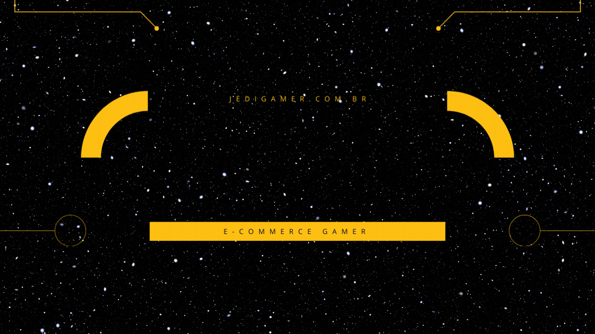

<h1 align="center">📝 Jedi Shop Gamer 📝</h1>
<br>
<br>


<br>
<p align="center">
  <a href="#-descrição">Descrição</a>&nbsp;&nbsp;&nbsp;|&nbsp;&nbsp;&nbsp;
  <a href="#-objetivo">Objetivo</a>&nbsp;&nbsp;&nbsp;|&nbsp;&nbsp;&nbsp;
  <a href="#-Estrutura do Projeto">Estrutura do Projeto</a>&nbsp;&nbsp;&nbsp;|&nbsp;&nbsp;&nbsp;
  <a href="#-Requisitos">Requisitos</a>&nbsp;&nbsp;&nbsp;|&nbsp;&nbsp;&nbsp;
  <a href="#-Como usar">Como usar</a>&nbsp;&nbsp;&nbsp;|&nbsp;&nbsp;&nbsp;
  <a href="#-Configuração">Configuração</a>&nbsp;&nbsp;&nbsp;|&nbsp;&nbsp;&nbsp;
  <a href="#licença">Licença</a>&nbsp;&nbsp;&nbsp;|&nbsp;&nbsp;&nbsp;
</p>

# 🎓Info
<p align="center">

Professor: Dr. Aldo Henrique Dias Mendes

Participantes: Lucas silva, Luan medrado

Disciplina: Programacao web

Semestre: 2024/1
</p>

# 📝Descrição:

O Jedi Shop Gamer é um e-commerce desenvolvido para atender às necessidades dos gamers mais exigentes. Nossa plataforma oferece uma ampla variedade de produtos relacionados ao universo dos jogos, desde consoles e acessórios até jogos, colecionáveis e vestuário temático.

<br>


# 🎯Objetivos

Nosso objetivo é proporcionar uma experiência de compra online completa e intuitiva para os gamers, oferecendo um catálogo diversificado, preços competitivos e um ambiente seguro e confiável para suas transações.

<br>


# 🔧Estrutura do Projeto

O projeto Jedi Shop Gamer está organizado da seguinte forma:

- Pasta backend: Contém toda a lógica do servidor, incluindo:
    - Conexão com o banco de dados PostgreSQL
    - Rotas da API (Node.js)
    - Validações de dados
    - Lógica de negócio (processamento de pedidos, gerenciamento de estoque, etc.)
      <br>
      
- Pasta views: Contém os arquivos relacionados à interface do usuário: <br>
    - Páginas HTML
    - Estilos CSS
    - Scripts JavaScript (interação com a API, animações, etc.)
<br>

# 🚩Requisitos

- Node.js: Ambiente de execução JavaScript para o backend.
- PostgreSQL: Banco de dados relacional para armazenar os dados do e-commerce.
- npm (Node Package Manager): Gerenciador de pacotes para instalar as dependências do projeto.

<br>


# 👩‍🔧Como usar

1. Clone o repositório:

    - Bash
        ```git clone https://github.com/Lucca7r/web-e-comerce.git```

2. Instale as dependências:

    - Bash
        ```cd jedi-shop-gamer```<br>
        ```npm install```

3. Configure o banco de dados:

    - Crie um banco de dados PostgreSQL.
    - Edite o arquivo de configuração do banco de dados (geralmente em backend/config/database.js) com as informações de conexão (host, porta, usuário, senha, nome do banco).

4. Execute o projeto:

    - Modo desenvolvimento (com recarga automática):
       ``` Bash```
        ```npm run dev```
    - Modo produção:
        ```Bash```
        ```npm start```

5. Acesse o e-commerce:

    - Abra o navegador e acesse http://localhost:3000 (ou a porta configurada).


# ⚙️Configuração
   - Banco de dados: As configurações do banco de dados (host, porta, usuário, senha, nome do banco) devem ser definidas no arquivo de configuração (geralmente em backend/config/database.js).<br>
   - Porta do servidor: A porta em que o servidor Node.js irá rodar pode ser configurada no arquivo de configuração (geralmente em backend/config/server.js).
<br>


# ©Licença:

Este repositório está licenciado sob a licença MIT.
<p align="center">
  
</p>
